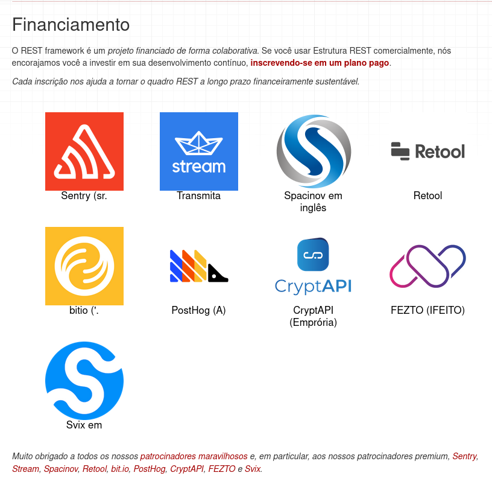

# Logo da API


# Documentação da API - Django Rest Framework

[Documentação Oficial](https://www.django-rest-framework.org/)


# Patrocinadores



Esta API foi desenvolvida usando o Django Rest Framework. Para mais detalhes sobre como usar o Django Rest Framework para criar APIs poderosas em Django, consulte a documentação oficial clicando no link acima.


# API de Usuários

Aqui está o cabeçalho Markdown melhorado, reorganizado para seguir uma ordem de procedimentos sugerida para os desenvolvedores:

```markdown
# Documentação da API - Django Rest Framework

# Descrição

Esta API permite realizar operações CRUD (Criar, Ler, Atualizar, Excluir) em usuários, além de oferecer endpoints para autenticação de login e logout usando tokens de autenticação.

Para mais detalhes sobre o Django Rest Framework, consulte a [documentação oficial](https://www.django-rest-framework.org/).

## Procedimentos

1. **Autenticação de Login**
   - Realiza a autenticação do usuário e retorna um token de autenticação.
   - **Método HTTP**: POST
   - **URL**: `/api-auth/login/`
   - **Exemplo cURL**:
     ```bash
     curl -X POST http://localhost:8000/api-auth/login/ -d "username=seu_usuario&password=sua_senha"
     ```

2. **Listar Usuários**
   - Retorna uma lista de todos os usuários cadastrados.
   - **Método HTTP**: GET
   - **URL**: `/users/`
   - **Exemplo cURL**:
     ```bash
     curl -X GET http://localhost:8000/users/ -H "Authorization: Token seu_token_aqui"
     ```

3. **Criar Usuário**
   - Cria um novo usuário com os dados fornecidos.
   - **Método HTTP**: POST
   - **URL**: `/users/`
   - **Exemplo cURL**:
     ```bash
     curl -X POST http://localhost:8000/users/ -H "Authorization: Token seu_token_aqui" -d '"username=novo_usuario&password=nova_senha"
     ```

4. **Detalhes do Usuário**
   - Retorna os detalhes de um usuário específico.
   - **Método HTTP**: GET
   - **URL**: `/users/{id}/`
   - **Exemplo cURL**:
     ```bash
     curl -X GET http://localhost:8000/users/{id}/ -H "Authorization: Token seu_token_aqui"
     ```

5. **Atualizar Usuário**
   - Atualiza os dados de um usuário existente.
   - **Método HTTP**: PUT
   - **URL**: `/users/{id}/`
   - **Exemplo cURL**:
     ```bash
     curl -X PUT http://localhost:8000/users/{id}/ -H "Authorization: Token seu_token_aqui" -d '{"username": "novo_nome"}'
     ```

6. **Excluir Usuário**
   - Exclui um usuário existente.
   - **Método HTTP**: DELETE
   - **URL**: `/users/{id}/`
   - **Exemplo cURL**:
     ```bash
     curl -X DELETE http://localhost:8000/users/{id}/ -H "Authorization: Token seu_token_aqui"
     ```

7. **Logout**
   - Encerra a sessão de autenticação do usuário.
   - **Método HTTP**: POST
   - **URL**: `/api-auth/logout/`
   - **Exemplo cURL**:
     ```bash
     curl -X POST http://localhost:8000/api-auth/logout/ -H "Authorization: Token seu_token_aqui"
     ```

7. **Validação**
   - Encerra a sessão de autenticação do usuário.
   - **Método HTTP**: POST
   - **URL**: `/api-auth/login/`
   - **Exemplo cURL**:
     ```bash
      curl --location 'http://localhost:8000/api-auth/login/' \
      --header 'Content-Type: application/x-www-form-urlencoded' \
      --header 'Authorization: Token <seu_token_aqui>' \
      --data-urlencode 'username=<seu_nome_de_usuario_aqui>' \
      --data-urlencode 'password=<sua_senha_aqui>'
     ```

Lembre-se de incluir o token de autenticação obtido durante o processo de login no cabeçalho `Authorization` ao fazer solicitações autenticadas.
```

Espero que este formato atenda às suas necessidades! Se precisar de mais alguma coisa, estou aqui para ajudar.`Authorization`.
```

Este documento Markdown fornece uma visão geral dos endpoints disponíveis na API de usuários, juntamente com exemplos de uso cURL para cada um deles. Espero que isso atenda às suas expectativas! Se precisar de mais alguma coisa, estou à disposição para ajudar.